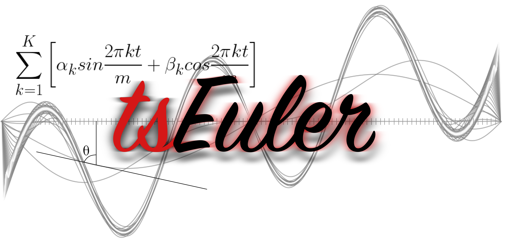

<h2> Hi, I'm Achintya!  </h2>

<figure >
  
  <figcaption align='right'>Getting ready to take over the WORLD..🌎.</figcaption>      
</figure>  

A Back-Packing junkie, who graduated in Electrical Engineering, and is now working in Data Science (What people like to call *Artificial Intelligence*🤩) as a, guess what, Data Scientist.. 

<h2> 📑 My Works. </h2>

- [SWTloc : Stroke Width Transform Library](https://github.com/ag-ds-bubble/swtloc)
   

- [TsEuler : Library for Time Series Exploration Analysis & Modelling](https://github.com/ag-ds-bubble/tseuler)
   

<h2> 📬 Connect </h2>

